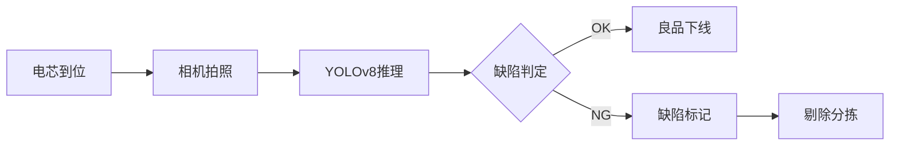

# Markdown 转 PPTX 专项功能指南

> 基于 Pandoc 的 Markdown 转 PowerPoint 演示文稿完整方案
> 整合 CSDN 社区经验、Pandoc 官方文档及社区最佳实践

---

## 一、快速入门

### 1.1 基本命令

```powershell
# 最简转换
pandoc slides.md -o slides.pptx

# 指定标题
pandoc slides.md -o slides.pptx --metadata title="我的演示文稿"

# 使用自定义模板
pandoc slides.md -o slides.pptx --reference-doc=template.pptx

# 指定幻灯片层级
pandoc slides.md -o slides.pptx --slide-level=2
```

### 1.2 一行命令全流程

```powershell
pandoc input.md -o output.pptx --reference-doc=theme.pptx --slide-level=2 --metadata title="标题" --filter mermaid-filter.cmd
```

---

## 二、Markdown 幻灯片语法

### 2.1 幻灯片分页

Pandoc 支持三种分页方式：

| 方式 | 语法 | 说明 |
|------|------|------|
| **一级标题** | `# 标题` | 创建新幻灯片，通常用作章节标题页 |
| **二级标题** | `## 标题` | 创建新幻灯片（常用） |
| **水平线** | `---` | 创建无标题幻灯片 |

```markdown
# 封面标题

---

## 第二页

- 项目一
- 项目二

---

## 第三页

这里是正文内容

---

仅正文，无标题
```

### 2.2 YAML 元数据

在文件开头用 `---` 包裹的 YAML 块定义全局元数据：

```yaml
---
title: "储能企业AI配套方案汇报"
subtitle: "2025年度技术方案"
author: "重庆宇量微澜人工智能有限公司"
date: "2025-06-10"
lang: zh-CN
---
```

### 2.3 Slide Level（幻灯片层级）

`--slide-level` 控制哪一级标题生成新幻灯片：

| 值 | 行为 |
|----|------|
| `--slide-level=1` | `#` 生成新幻灯片，`##` 及以下为同页内容 |
| `--slide-level=2` | `#` 生成分节标题页，`##` 生成新幻灯片（**推荐**） |
| `--slide-level=3` | `#` 和 `##` 为分节，`###` 生成新幻灯片 |

**最佳实践：** 大多数场景使用 `--slide-level=2`，此时 `#` 作为章节分隔页，`##` 作为正文页。

---

## 三、样式定制：参考文档模板

### 3.1 `--reference-doc`（正确用法）

> **注意：** CSDN 等部分文章误用 `--template` 参数，Pandoc 对 PPTX 输出的正确参数是 **`--reference-doc`**。`--template` 仅用于 HTML/LaTeX 输出，PPTX 不支持。

```powershell
pandoc slides.md -o slides.pptx --reference-doc=my-template.pptx
```

### 3.2 制作参考模板

模板需包含以下 7 种布局（按此顺序，在 PowerPoint 母版中定义）：

| 布局名称 | 用途 |
|---------|------|
| **Title Slide** | 标题幻灯片 |
| **Title and Content** | 标题+正文 |
| **Section Header** | 章节分隔页 |
| **Two Content** | 两栏内容 |
| **Comparison** | 对比布局 |
| **Content with Caption** | 带标题的内容 |
| **Blank** | 空白页 |

#### 制作步骤

1. 打开 PowerPoint → 新建空白演示文稿
2. **视图 → 幻灯片母版**
3. 依次修改各布局的：
   - 主题颜色（设计 → 颜色）
   - 字体方案（设计 → 字体）
   - 背景样式
   - 占位符位置与大小
4. 保存为 `template.pptx`
5. 执行转换：`pandoc slides.md -o slides.pptx --reference-doc=template.pptx`

> **提示：** 也可以直接使用网上下载的精美 PPTX 模板作为 `--reference-doc`。

### 3.3 生成默认模板

```powershell
# 导出 Pandoc 内置默认模板，供修改参考
pandoc -o default.pptx --print-default-data-file reference.pptx
```

---

## 四、高级布局技巧

### 4.1 多列布局

使用 fenced div 实现多栏并排：

```markdown
:::: {.columns}

::: {.column}
**左栏内容**
- 要点一
- 要点二
- 要点三
:::

::: {.column}
**右栏内容**
- 项目A
- 项目B


:::

::::
```

### 4.2 演讲者备注

```markdown
## 页面标题

正文内容...

::: notes
这里是演讲者备注，仅演讲者可见。

- 支持列表
- *Markdown 格式*
:::
```

### 4.3 增量列表

逐条显示（适合分步讲解）：

**全局启用：**
```yaml
---
title: "标题"
format:
  pptx:
    incremental: true
---
```

**局部控制**（Pandoc 2.15+）：
```markdown
::: {.incremental}
- 第一条先出现
- 第二条后出现
- 最后出现
:::

::: {.nonincremental}
- 全部同时出现
- 不受全局设置影响
:::
```

### 4.4 图片控制

```markdown
# 基础用法


# 指定尺寸
{width=70%}

# 带超链接的图片
[](fullsize.png)
```

> **注意：** 图片和表格**总是**独占新幻灯片。同一幻灯片无法同时放置图片和正文（除标题和标注外）。若需图文同页，需使用 **Two Content 布局**（见第 4.1 节）。

### 4.5 表格

```markdown
| 能力项 | 技术说明 | 适用场景 |
|-------|---------|---------|
| AI视觉质检 | YOLOv8检测 | 电芯外观 |
| 知识库 | RAG检索 | 智能问答 |
| MCP连接器 | 协议转换 | 系统集成 |

Table: 核心能力一览表
```

---

## 五、Mermaid 图表支持

### 5.1 安装依赖

```powershell
npm install -g @mermaid-js/mermaid-cli
npm install -g mermaid-filter
```

### 5.2 转换命令

```powershell
pandoc slides.md -o slides.pptx --filter mermaid-filter.cmd
```

### 5.3 支持的图表类型

mermaid-filter 当前使用 `mermaid@10.9.6`，支持以下类型：

✅ `flowchart` · `sequenceDiagram` · `classDiagram` · `stateDiagram-v2` ·
`erDiagram` · `gantt` · `pie` · `mindmap` · `timeline` · `gitGraph`

❌ **不支持**（需 mermaid ≥ 11）：
- `quadrantChart`（象限图）→ 改用 `flowchart` + `subgraph` 模拟
- `C4Context` / `C4Container`（C4 模型图）→ 改用 `flowchart` + `subgraph`

---

## 六、复杂标记语法示例

### 6.1 完整 PPT 模板

```markdown
---
title: "储能企业AI配套方案"
subtitle: "AI智能体能力底座与非标自动化"
author: "宇量微澜"
date: "2025-06-10"
---

# 储能企业AI配套方案

## AI智能体能力底座 + 非标自动化

---

## 核心能力概览

:::: {.columns}

::: {.column}
### AI智能体能力底座
- 企业级私有化AI中台
- 拖拽式智能体构建
- 多模态模型管理
- 知识库与RAG检索
:::

::: {.column}
### 非标自动化
- 电池模组自动装配线
- AI视觉质检
- 测试台架
- PLC/机器人集成
:::

::::

---

## AI视觉质检流程



---

## 项目进度计划

| 阶段 | 时间 | 交付物 |
|------|------|--------|
| 需求调研 | 第1-2周 | 需求文档 |
| AI底座部署 | 第3-6周 | 平台上线 |
| 产线集成 | 第7-10周 | 联调完成 |
| 试运行 | 第11-12周 | 验收报告 |

::: notes
这是一个典型的6周交付计划
:::

---

## 联系我们

- **公司：** 重庆宇量微澜人工智能有限公司
- **核心能力：** AI智能体 · 非标自动化
```

### 6.2 标记语法参考速查

| Markdown 语法 | PPTX 效果 | 说明 |
|--------------|----------|------|
| `# 标题` | 新幻灯片 | slide-level=1 创建幻灯片 |
| `## 标题` | 新幻灯片 | slide-level=2 创建幻灯片 |
| `---` | 幻灯片分隔 | 创建无标题页 |
| `**粗体**` | 粗体 | — |
| `*斜体*` | 斜体 | — |
| `~~删除~~` | 删除线 | — |
| `^上标^` | 上标 | — |
| `~下标~` | 下标 | — |
| `` `代码` `` | 等宽字体 | 行内代码 |
| ` ``` ` 代码块 | 代码块 | 语法高亮 |
| `> 引用` | 引用块 | — |
| `$$ 公式 $$` | LaTeX 公式 | 渲染为图片 |
| `---`（YAML） | 元数据 | 标题/作者/日期 |
| `` | 图片 | 独占幻灯片 |
| `[链接](url)` | 超链接 | — |
| `|表格|` | PPTX 原生表格 | 独占幻灯片 |
| `::: {.columns}` | 多栏布局 | fenced div |
| `::: notes` | 演讲者备注 | 仅演讲者可见 |
| `::: {.incremental}` | 增量列表 | 逐条显示 |
| ````mermaid` | 图表 | 需 mermaid-filter |

---

## 七、常见问题与排查

### 7.1 问题速查表

| 问题 | 原因 | 解决方案 |
|------|------|---------|
| 模板样式未生效 | `--template` 参数错误 | 改为 `--reference-doc` |
| 模板路径错误 | 路径含空格未加引号 | 用双引号包裹路径 |
| YAML 变量未识别 | 模板缺少对应占位符 | 修改母版中的占位符名 |
| 幻灯片分页错乱 | `---` 前后缺空行 | 确保空行分隔 |
| 图片与正文不同页 | PPTX 限制 | 改用 Two Content 布局 |
| Mermaid 渲染失败 | 语法不兼容 | 检查是否属于不支持的图表类型 |
| 中文字体乱码 | 模板未嵌入字体 | 在 PPTX 母版中设置中文字体 |
| PPTX 打不开 | 模板兼容性问题 | 用 PowerPoint 打开模板并重新保存 |
| 精度问题 | 分辨率不足 | 在模板中调整占位符大小 |

### 7.2 调试命令

```powershell
# 显示详细日志
pandoc slides.md -o slides.pptx --verbose

# 查看当前 Pandoc 版本
pandoc --version

# 导出内置参考文档（默认模板）
pandoc --print-default-data-file reference.pptx -o default.pptx
```

---

## 八、工具对比与选型

### 8.1 主流方案对比

| 工具 | 原理 | 优点 | 缺点 |
|------|------|------|------|
| **Pandoc**（推荐） | Markdown → PPTX 原生 | 输出为真 PPTX，可直接编辑 | 布局灵活性有限 |
| **Marp** | Markdown → HTML/PDF/PPTX | 专为幻灯片设计，CSS 主题 | PPTX 输出需额外转换 |
| **Slidev** | Markdown → SPA → 导出 | 交互动画丰富，开发者友好 | 依赖 Node.js，学习成本 |
| **Reveal.js** | HTML 幻灯片框架 | 视觉效果强，支持嵌入 | 输出非标准 PPTX 格式 |
| **Quarto** | 增强 Pandoc | R/Python 集成，学术友好 | 生态偏数据分析 |

### 8.2 场景推荐

| 场景 | 推荐方案 |
|------|---------|
| 快速生成标准 PPTX | Pandoc + reference-doc |
| 技术演讲/代码展示 | Marp 或 Slidev |
| 数据分析报告 | Quarto |
| 需要炫酷 CSS 动画 | Reveal.js |
| 团队协作模板 | Pandoc + CI/CD |

---

## 九、完整转换脚本

### 单文件转换

```powershell
param(
    [string]$input = "slides.md",
    [string]$output = "",
    [string]$template = "",
    [int]$slideLevel = 2
)

if (-not $output) {
    $output = [System.IO.Path]::ChangeExtension($input, ".pptx")
}

$cmd = "pandoc `"$input`" -o `"$output`" --slide-level=$slideLevel"

if ($template) {
    $cmd += " --reference-doc=`"$template`""
}

# 检测 mermaid-filter 并附加
try {
    npm show mermaid-filter > $null 2>&1
    $cmd += " --filter mermaid-filter.cmd"
    Write-Host "[✓] mermaid-filter 已启用"
} catch {
    Write-Host "[!] mermaid-filter 未安装,跳过图表渲染"
}

Write-Host "执行: $cmd"
Invoke-Expression $cmd
Write-Host "[✓] 已生成: $output"
```

### 批量转换

```powershell
Get-ChildItem "*.md" | ForEach-Object {
    $output = $_.BaseName + ".pptx"
    pandoc $_.Name -o $output --slide-level=2 --reference-doc=template.pptx
    Write-Host "[✓] $($_.Name) → $output"
}
```

---

## 十、参考资料

- [Pandoc 官方手册 - 幻灯片](https://pandoc.org/MANUAL.html#slide-shows)
- [Pandoc PPTX 模板指南](https://pandoc.org/MANUAL.html#creating-the-powerpoint-template)
- [Posit/RStudio - PowerPoint 渲染](https://support.posit.co/hc/en-us/articles/360004672913)
- [Quarto - PowerPoint 演示文稿](https://quarto.org/docs/presentations/powerpoint.html)
- [R Markdown 官方 - PowerPoint 演示](https://bookdown.org/yihui/rmarkdown/powerpoint-presentation.html)
- [CSDN - 如何使用Pandoc将Markdown转换为带有绚丽模板的PPTX](https://ask.csdn.net/questions/8612615)

---

> 文档版本：v1.0  
> 最后更新：2025-06-10  
> 适用范围：tiger-office-skill / Pandoc 3.8