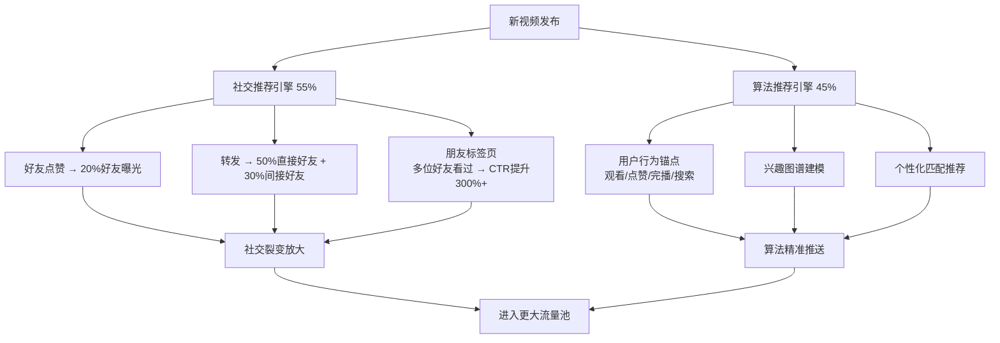
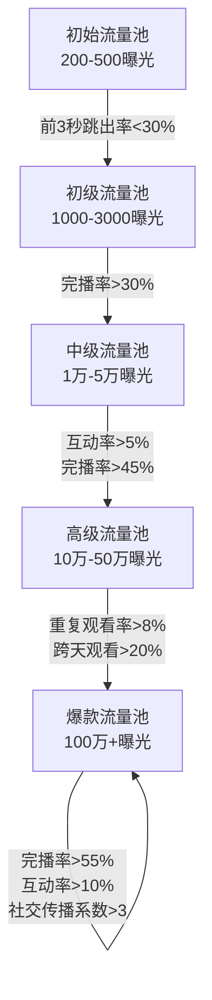
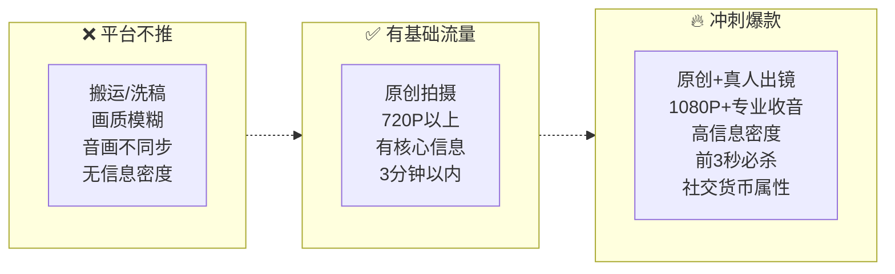

# 视频号起流量指南

## 从算法原理到每天执行的完整方法论

| 版本 | 修改日期 | 修改内容 |
|------|----------|----------|
| V1.0 | 2026-06-08 | 初稿（综合多方资料+网络搜索整理） |

---

## 目录

- [一、核心认知：视频号和其他平台的区别](#一核心认知视频号和其他平台的区别)
- [二、算法底层逻辑：双引擎驱动](#二算法底层逻辑双引擎驱动)
- [三、流量池分级机制](#三流量池分级机制)
- [四、核心考核指标详解](#四核心考核指标详解)
- [五、账号权重体系](#五账号权重体系)
- [六、内容创作方法论](#六内容创作方法论)
- [七、社交裂变实操](#七社交裂变实操)
- [八、新号冷启动7天执行清单](#八新号冷启动7天执行清单)
- [九、日常数据复盘框架](#九日常数据复盘框架)
- [十、2026年新规与合规红线](#十2026年新规与合规红线)
- [十一、常见问题Q&A](#十一常见问题qa)

---

## 一、核心认知：视频号和其他平台的区别

很多人在视频号做不起来，第一个错误就是**把抖音那套直接搬过来**。

### 视频号 vs 抖音 本质差异

| 维度 | 抖音 | 视频号 |
|------|------|--------|
| **核心驱动** | 算法推荐（内容找人） | **社交推荐**（朋友找人） |
| **初始流量** | 纯公域分发 | 私域（好友/社群/粉丝）撬动公域 |
| **推荐占比** | 算法推荐 ≈ 90% | **社交推荐 ≈ 55%** + 算法推荐 ≈ 45% |
| **用户心理** | 陌生人娱乐 | 熟人信任+社交价值 |
| **核心指标** | 完播率+点赞率 | **完播率+社交传播系数** |
| **内容偏好** | 娱乐、颜值、剧情 | 知识、干货、实用技巧 |
| **破圈路径** | 投流+算法匹配 | 朋友圈裂变+社群转发 |

### 一句话总结

> **抖音是"内容找人"，视频号是"朋友找人"。**
>
> 一个视频被好友点赞后，会推荐给**该好友20%的微信好友**。这是视频号最核心、也最独特的流量放大器。用好社交裂变，100私域 → 10万公域不是梦。

---

## 二、算法底层逻辑：双引擎驱动

视频号算法由**社交推荐**和**算法推荐**两大引擎构成，两者相互作用共同决定内容分发范围。



### 2.1 社交推荐引擎（55%权重）

这是视频号区别于所有短视频平台的核心优势：

| 机制 | 触发条件 | 放大效果 |
|------|----------|----------|
| **好友点赞** | 好友点赞你的视频 | 曝光给该好友20%的微信好友 |
| **好友评论** | 好友评论你的视频 | 触发"朋友热议"标签，点击欲望大幅提升 |
| **主动转发** | 好友转发到群/朋友圈 | 触达转发者50%直接好友 + 30%间接好友 |
| **社交唤醒** | "朋友点赞"的社交背书 | 比普通算法推荐点击率高**5倍** |

**关键认知**：视频号是唯一能在48小时内实现 **"100私域 → 10万公域"** 流量跃迁的平台。前提是你的内容必须有**社交价值**——让人愿意为你点赞和转发。

### 2.2 算法推荐引擎（45%权重）

- 基于用户**观看、点赞、完播、停留、搜索**等行为构建兴趣图谱
- 不依赖人工打标，通过用户连续3次主动搜索/点击同类内容、停留超2分钟等行为锚点建模
- **垂直领域识别**：个人简介标注行业标签、头像使用职业形象，可提升推荐精准度

---

## 三、流量池分级机制

视频号采用**金字塔式流量分配**，每个层级都有严格的数据考核标准，达标后自动进入更大流量池。



### 流量池门槛对照表

| 流量池层级 | 曝光量级 | 核心考核指标 | 达标阈值 | 不达标的后果 |
|-----------|---------|-------------|---------|-------------|
| **初始池** | 200-500 | 前3秒跳出率 | <30% | 停止推荐，卡在300 |
| **初级池** | 1000-3000 | 完播率 | >30% | 退回初始池 |
| **中级池** | 1万-5万 | 互动率+社交传播 | 互动率>5%，完播率>45% | 退回初级池 |
| **高级池** | 10万-50万 | 跨天留存+重复观看 | 重复观看率>8%，跨天观看>20% | 退回中级池 |
| **爆款池** | 100万+ | 综合数据+社交裂变 | 完播率>55%，互动率>10% | 持续考核 |

### 冷启动关键期（黄金72小时）

- 新发布视频首先触达**关注者、好友、社群**的自然流量
- **前5分钟数据决定生死**：系统抓取前100个用户行为，重点看**停留时长>40秒**的用户占比
- **3秒滑出率是核心门槛**：>45%将被判为低质量内容，推流速度大幅下降

---

## 四、核心考核指标详解

### 4.1 指标权重分配（2026最新）

| 指标 | 权重 | 说明 |
|------|------|------|
| **完播率** | **35%** | 算法判断内容质量的**首要标准** |
| **互动指数** | **30%** | 排序：**转发 > 评论 > 点赞 > 收藏** |
| **停留时长** | **20%** | 人均观看时长需达视频长度的**50%** 以上 |
| **账号权重** | **10%** | 稳定性+专业性双维度 |
| **社交传播** | **5%** | 破圈的关键催化剂 |

### 4.2 关键指标详解

| 指标 | 计算方法 | 达标线 | 优化方法 |
|------|----------|--------|----------|
| **3秒跳出率** | 前3秒离开用户 / 总播放 | **<30%** | 开头直接抛痛点/悬念/反常识，不要铺垫 |
| **有效完播率** | 观看时长>45秒或拖拽回看的用户占比 | **>30%** | 每15秒设一个记忆点/视觉锚点 |
| **互动率** | (转发+评论+点赞+收藏) / 播放量 | **>5%** | 评论区引导话术、提问式结尾 |
| **重复观看率** | 同一用户再次观看的占比 | **>8%** | 高信息密度内容，用户需回看理解 |
| **跨天观看** | 发布次日仍有新用户观看 | **>20%** | 关键词埋入标题，搜索流量加权 |
| **评论回复率** | 作者回复评论数 / 总评论数 | **>30%** | 每条评论及时回复，引导追问 |

### 4.3 重要数据阈值速查

```
前3秒跳出率 < 30%  → 通过初始流量池
完播率     > 30%  → 进入初级流量池
互动率     > 5%   → 进入中级流量池
重复观看率  > 8%   → 进入高级流量池
完播率     > 55%  → 爆款候选
3秒跳出率每降低10% → 推流效率提升40%
```

---

## 五、账号权重体系

### 5.1 权重三维模型

```
账号权重 = 稳定性 × 0.4 + 专业性 × 0.35 + 健康度 × 0.25
```

| 维度 | 计算公式 | 提升方法 |
|------|----------|----------|
| **稳定性** | 近7天发布频次误差≤1天 | 固定时间发布，保持周更≥3条 |
| **专业性** | 垂直内容占比>80%，非粉丝首次观看完成率>55% | 专注一个赛道，简介写清行业标签 |
| **健康度** | 无违规、无搬运、无低质内容 | 原创拍摄，避免搬运拼接 |

### 5.2 账号基建清单

以下6项，每一项都会影响初始推荐量：

| 项目 | 要求 | 推荐配置 |
|------|------|----------|
| **昵称** | 简单易记，与内容强相关 | "XX说XX"，如"阿强说运营" |
| **头像** | 真人出镜或品牌LOGO，高辨识度 | 正面半身照，背景简洁 |
| **简介** | 一行话说清账号价值 | "每天分享XX技巧，帮你搞定XX问题" |
| **职业标签** | 填写与内容相关的真实职业 | "家庭教育指导师""自媒体运营" |
| **认证** | 微信实名+蓝V认证 | 首推曝光量平均高出**210%** |
| **绑定** | 绑定公众号、企业微信 | 流量协同，私域沉淀 |

**数据验证**：规范完成以上6项的账号，首推曝光量比未完成的账号**高出220%**。

### 5.3 账号自我修养——发视频前的准备

这一步被绝大多数新手忽略，却恰恰是决定账号能不能做起来的**分水岭**。

很多人做不起来不是因为内容不好，而是**账号本身在系统眼中就是个"异常账号"**——系统不会给异常账号推荐流量。

**第一步：先纠正刷视频的习惯**

大多数人刷视频是这样的：划几秒就点赞、迅速划走、闪进闪退。在平台眼中，这种行为很不正常。长期如此，系统很容易判定账号存在异常，你自己发布视频时播放量自然上不去。

正确的做法：

> 刷到**同领域**的视频，**耐心完整看完**，真心点赞，留下有价值的评论。

这是在向系统表明：你是**真实活跃的用户**，且对这类内容有浓厚兴趣。这为账号后续发展打下基础。

**第二步：搜索领域关键词，锁定精准流量池**

打开视频号 → 点击右上角放大镜 → 输入你要深耕领域的关键词（技巧分享/育儿/美食/健身等）。

你会看到前列都是做得成功的大号，以及点赞量超十万的爆款视频。这一步先**不要发布自己的作品**，而是：

1. 观看这些优质内容
2. 完整看完后点赞、收藏
3. 让系统认定你是该领域的真实用户

**第三步：从爆款话题标签入口发布（关键技巧）**

点开一条十万赞以上的爆款视频 → 进入评论区 → 留意评论区上方蓝色的 **#话题标签** → 点击进入 → 你会看到里面全是同领域内容，页面右上角有发布入口。

> **第一批作品，务必从这个入口发布。**

从经过市场验证的爆款话题流量池发视频，作品会自动匹配对应标签。这一步同时实现三个效果：

| 效果 | 说明 |
|------|------|
| 增加话题热度 | 视频自带流量话题标签 |
| 打上清晰定位标签 | 系统快速识别你的垂直领域 |
| 推送给精准人群 | 该标签下的活跃用户优先看到 |

**第四步：勾选原创**

发布视频时，**务必勾选"原创"**。这是很多人容易忽略，却又极为关键的一步。原创内容的推荐权重比非原创高**3倍**。

**总结**：

```
先养号 → 找对标签入口 → 勾选原创 → 再优化内容质量
```

等你熟练运用这套流程后，再去优化内容节奏、完播率和互动率，这些操作才会真正发挥作用。否则就像盖楼不打地基，内容再好也推不出去。

---

## 六、内容创作方法论

### 6.1 内容质量金字塔



### 6.2 选题三原则

每个选题必须满足以下**至少一个**条件：

| 类型 | 核心 | 适合领域 | 用户心理 |
|------|------|----------|----------|
| **实用干货型** | 看完能解决问题 | 知识/技能/教程 | "学到了，收藏转发" |
| **情绪共鸣型** | 戳中共同情绪 | 职场/生活/情感 | "说的就是我，点赞评论" |
| **悬念好奇型** | 开头就抓住眼球 | 通用 | "想知道答案，看完" |

**选题自检**：用"定位三问"框定方向——
1. 我能持续输出什么内容？（至少50期）
2. 我的目标用户是谁？
3. 我能给用户带来什么价值？

### 6.3 3秒开头公式

```
❌ 错误开头："大家好，今天我给大家分享一个技巧..."
❌ 错误开头："首先，我们来了解一下..."
```

```
✅ 痛点提问型："你是不是也一直遇到这个问题？"
✅ 结果前置型："只用这一招，直接解决多年难题！"
✅ 反常识型："90%的人都不知道这个隐藏功能"
✅ 数据震撼型："一条视频，3天卖了50万"
```

### 6.4 视频结构黄金模板

| 时间段 | 内容 | 目的 |
|--------|------|------|
| **0-3秒** | 痛点/悬念/反常识开篇 | 留住人 |
| **3-15秒** | 核心观点/解决方案 | 给价值 |
| **15-30秒** | 案例/实操/证据展示 | 建信任 |
| **30-40秒** | 总结+行动引导 | 促互动 |
| **最后5秒** | 点赞关注引导+评论区钩子 | 做转化 |

### 6.5 标题+封面优化

**标题结构公式**：

```
【身份标签】+ 痛点短句 + 结果承诺
示例：【职场新人】汇报总被打断？3招让老板主动记笔记
```

**标题类型**（20字以内）：

| 类型 | 模板 | 示例 |
|------|------|------|
| 数字干货型 | X个方法，搞定XX | 3个小技巧，搞定视频号低播放 |
| 痛点共鸣型 | XX别乱做，踩坑后悔 | 发视频别乱操作，难怪播放上不去 |
| 悬念好奇型 | 没想到XX还有这种用法 | 没想到日常发视频还有这些讲究 |

**封面三原则**：
1. 主体占画面**60%以上**
2. 对比色文字**≤8字**
3. 无干扰元素，高清无水印

### 6.6 视频质量标准

| 指标 | 最低要求 | 推荐配置 |
|------|----------|----------|
| **分辨率** | 720P | 1080P+（4K更佳） |
| **帧率** | 24fps | 30fps |
| **画幅** | 9:16竖屏 | 9:16竖屏 |
| **收音** | 无杂音 | 领夹麦/指向麦 |
| **时长** | 按内容定 | 新手期30-60秒最优 |
| **字幕** | 核心信息有字幕 | 全文自动字幕 |

---

## 七、社交裂变实操

### 7.1 冷启动三连动作（发布后5分钟内）

```
第1步：转发到朋友圈 + 配引导文案
第2步：分享到2-3个不同属性微信群
第3步：自己在评论区留第一条引导话术
```

### 7.2 不同群的不同引导方式

| 群类型 | 引导文案策略 | 示例 |
|--------|-------------|------|
| **家庭群** | 分享实用价值 | "妈，这个方法正适合您阳台那盆花" |
| **同事群** | 切入工作场景 | "会议室那绿植总死？我用这招养活了" |
| **兴趣群** | 切入共同话题 | "群里有人问过XX问题，这条视频讲清楚了" |

### 7.3 社交货币设计

朋友点赞/转发的动力不是帮你，而是**帮他们自己**。你的内容要让朋友觉得：

| 社交货币类型 | 设计方法 | 示例 |
|-------------|----------|------|
| **实用价值** | 转给别人有帮助 | "转给做教育的朋友看" |
| **身份标签** | 点赞塑造形象 | 点赞=我是懂XX的人 |
| **谈资话题** | 评论后拿去聊天 | "昨天看到个视频说..." |

### 7.4 互动钩子设置

| 位置 | 钩子类型 | 话术示例 |
|------|----------|----------|
| **视频结尾** | 提问引导 | "你遇到过这种情况吗？评论区聊聊" |
| **评论区置顶** | 利益驱动 | "点赞截图私信我，领XX模板" |
| **评论区回复** | 追问引导 | "你是在哪个行业？下期出针对性的" |
| **视频中间** | 选择题互动 | "小户型选投影仪还是电视？评论区告诉我" |

### 7.5 转发-裂变核心指标

```
发布后2小时内获得 ≥5位不同好友的主动点赞
  → 触发二级关系链曝光
  → 推荐效率提升数倍
```

---

## 八、新号冷启动7天执行清单

### 通用基础规范（全程遵守）

| 项目 | 规范 |
|------|------|
| **发布时间** | 优先**19:30-22:00**，备选12:00-13:30、07:30-09:00 |
| **发布频率** | 每天1条，固定时段，不要断更 |
| **视频时长** | 30-60秒（新手期），宁短勿长 |
| **领域** | 7天只做同一个垂直领域，不跨方向 |
| **标签** | 3-5个精准垂类标签，不蹭无关热门 |
| **私域冷启动** | 每条约朋友点赞+评论+转发 |

### 分天执行安排

| 天数 | 主题 | 执行重点 | 复盘要点 |
|------|------|----------|----------|
| **Day 1** | 启动日 | 常规垂类内容，使用**开头模板A** + **标题模板1**，完成全套冷启动 | 记录4项核心数据基线 |
| **Day 2** | 优化开头 | 同领域，换选题，使用**开头模板B**，视频控制在30-40秒 | 对比Day 1的3秒留存率 |
| **Day 3** | 优化标题+封面 | 全新设计封面，使用**标题模板2**，标签精简为3个核心词 | 重点看点击率、推荐流量 |
| **Day 4** | 强化互动 | 视频结尾加互动话术，发布后主动回复所有评论 | 关注评论率、转发率 |
| **Day 5** | 提速剪辑 | 视频压缩至30秒内，无多余铺垫，沿用前4天最优开头+标题 | 重点看**完播率** |
| **Day 6** | 风格复刻 | 复刻前5天数据最好的那条的结构和版式，加大私域传播 | 对比是否突破300基线 |
| **Day 7** | 综合冲刺 | 汇聚前6天所有优势创作，完成全套冷启动+评论维护 | 汇总数据，确定固定模板 |

### 每日数据检查项

每条视频必查以下4项：

```
1. 3秒留存率：目标 > 55%  | 低于则优化开头
2. 整体完播率：目标 > 20% | 低于则缩短视频/加快节奏
3. 推荐流量占比：目标 > 30% | 为0则整改封面/标题/标签
4. 互动数据(点赞/评论/转发) | 转发少则强化内容价值
```

### 兜底规则

1. 连续2条播放仍低于400 → 直接**删除/隐藏**，换全新选题重拍
2. 不发广告、不搬运、不使用违规音效/画面
3. 7天后保持固定时段+统一风格，巩固权重

---

## 九、日常数据复盘框架

### 9.1 每个视频必查的4项数据

| 数据项 | 健康值 | 低于健康值的对策 |
|--------|--------|-----------------|
| **3秒留存率** | >55% | 开头重做——直接上痛点/悬念 |
| **整体完播率** | >20% | 剪短视频、加快节奏、删掉所有铺垫 |
| **点赞率** | >3% | 增加内容价值密度或情感共鸣 |
| **分享率** | >1% | 设计社交货币属性，增加转发引导 |

### 9.2 每周深度分析

| 分析项 | 方法 |
|--------|------|
| **最佳内容特征** | 找出本周播放最高的3条，总结共性（选题/时长/开头/标题风格） |
| **最差内容问题** | 找出本周播放最低的3条，分析问题（是否跨领域/标题平淡/开头拖沓） |
| **发布时间验证** | 对比不同时段的推荐流量占比，确定黄金发布时段 |
| **粉丝画像确认** | 通过视频号后台确认粉丝分布是否符合目标人群 |

### 9.3 A/B测试方法

同一主题制作不同版本，小流量测试后确定最优方案：

```
变量1：标题风格（数字型 vs 悬念型 vs 痛点型）
变量2：封面设计（文字位置/颜色/大小）
变量3：开头方式（提问 vs 反常识 vs 结果前置）
变量4：视频时长（30秒 vs 60秒 vs 90秒）
```

---

## 十、2026年新规与合规红线

### 10.1 必须遵守的新规

| 规则 | 要求 | 违规后果 |
|------|------|----------|
| **AI内容标注** | 使用AI生成画面/数字人，必须在前5秒标注"AI生成" | 限流、下架 |
| **演绎内容声明** | 剧情摆拍需标注"剧情演绎/纯属虚构" | 限制推荐 |
| **专业领域资质** | 财经/医疗/法律需持证出镜 | 限制功能 |
| **禁止诱导营销** | 禁止"稳赚""翻倍""保本保息"等词汇 | 扣分、限流 |
| **禁止违规引流** | 所有场景禁留微信/手机号/二维码 | 严重违规封号 |
| **原创保护** | "画面抽帧+文案查重"双重检测 | 三次违规永久限流 |
| **低质同质化限流** | 脚本套路化、画质模糊将不推荐 | 不进入流量池 |
| **带货数量限制** | 粉丝<10万每日≤5条带货视频 | 超限限制 |
| **未成年人保护** | 禁止利用未成年人摆拍博流量 | 永久封禁 |

### 10.2 敏感词避雷

| 类型 | 禁用语 | 替代词 |
|------|--------|--------|
| 绝对化用语 | 最、第一、顶级、全网 | 实测、亲历、已验证 |
| 承诺收益 | 稳赚、翻倍、保本保息 | 方法、思路、经验 |
| 诱导行为 | 必须转、不转不是XX | 建议、推荐、可以 |
| 夸张表述 | 震惊、吓傻了、出大事了 | 没想到、才发现、值得注意 |

### 10.3 定期自查

- 历史内容自查：对AI生成/带货软广/剧情摆拍补标注
- 定期关注**视频号官方公告**，及时调整策略
- 保持原创垂直内容，避免搬运和诱导营销

---

## 十一、常见问题Q&A

### Q1：播放量一直卡在300左右，是不是被限流了？

不算严重限流（<100才算）。300属于**低权重/内容没爆点**的典型表现。主要原因是：
- 账号权重低，初始流量池固定给200-500
- 公域用户3秒就划走，算法判定内容不吸引人
- 流量来源几乎全是私域，公域推荐占比<20%

**对策**：按第8章7天清单执行，优化开头+封面+垂直度+私域撬动。

### Q2：一天发几条最好？

| 阶段 | 建议频率 |
|------|----------|
| **冷启动期** | 每天1条（质量优先） |
| **成长期** | 每天1-2条 |
| **稳定期** | 每天1条或隔天1条精品 |

**原则**：宁可不发，也不要发质量差的内容。一条好视频顶十条烂视频。

### Q3：要不要花钱投流（加热）？

- 自然流量推不动、连续5条播放低于300时，可以投50元测试
- 定向设置：关掉"相似达人粉丝"，只勾选"近30天活跃用户"+"视频号活跃用户"
- 投流只是加速器，**内容质量不过关，投再多也没用**

### Q4：视频时长控制在多少秒最好？

| 账号阶段 | 推荐时长 | 原因 |
|----------|----------|------|
| **新号冷启动** | 30-60秒 | 完播率更容易达标 |
| **有基础粉丝** | 60-90秒 | 信息量更充足 |
| **知识类/教程类** | 2-3分钟 | 干货类用户耐心更长 |

### Q5：为什么我内容很好但没人看？

90%的原因是**前3秒没留住人**。用户划走不是因为后面内容不好，而是根本没看到后面。

### Q6：能不能同时做多个领域？

**不能**。前5条视频决定初始标签，频繁切换领域会让系统无法稳定打标，直接降低推荐概率。至少3个月内只做**同一个垂直领域**。

### Q7：什么时间发布最好？

| 时段 | 适合场景 | 优先级 |
|------|----------|--------|
| **19:30-22:00** | 黄金时段，用户最活跃 | ⭐⭐⭐ |
| **12:00-13:30** | 午休刷手机 | ⭐⭐ |
| **07:30-09:00** | 通勤时段 | ⭐ |

固定时间发布能培养粉丝观看习惯，提升账号权重。

### Q8：要不要蹭热点？

要蹭，但必须满足条件：
- 热点与你的领域**强相关**
- 标题/字幕/口播中至少出现2处与热点**强关联的实体词**
- 单纯加话题但内容无关，反而触发降权

热点前72小时的视频播放量平均高出常规内容**217%**。

---

> **文档结束**
>
> 本文档综合现有参考材料与2026年公开搜索资料整理而成，核心数据和规则来源于视频号官方文档及行业实测数据。平台算法持续迭代，建议定期关注微信官方公告获取最新规则。

---

**参考资料**（网络搜索整理）：
- 视频号流量机制算法深度解读（2026全新版）
- 视频号推荐机制2026最新规则
- 新榜：视频号流量提升与涨粉实战解决方案
- 视频号内容合规与运营新规（2026）
- 视频号连续被推荐原因解析与破局方案